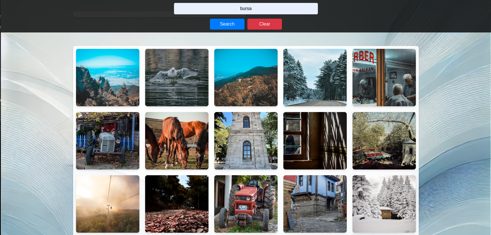

# Image Finder Application



This is a simple web application that allows users to search for images using the Unsplash API. Users can view images, enlarge them, and download them directly from the application.

## Live Demo

You can access the live application at:
[Image Finder](https://orhanguezel.github.io/ImageFinder/)

## Features

- Search for images using the Unsplash API.
- Enlarge images by clicking on them.
- Download images in full resolution.
- Responsive design with a visually appealing background.

## Project Structure

Below is the directory structure of the project:

```
/ImageFinder/
├── README.md
├── style.css
├── package.json
├── package-lock.json
├── index.html
├── background.png
├── app.js
├── node_modules
```

## Technologies Used

- HTML
- CSS
- JavaScript
- Unsplash API
- gh-pages for deployment

## Installation

1. Clone the repository:
   ```bash
   git clone https://github.com/orhanguezel/ImageFinder.git
   ```
2. Navigate to the project directory:
   ```bash
   cd ImageFinder
   ```
3. Install dependencies:
   ```bash
   npm install
   ```

## Usage

1. Start the application locally:
   ```bash
   npm start
   ```
2. Open the application in your browser at `http://localhost:3000` (or your configured port).

## Deployment

The application is deployed using GitHub Pages. To deploy the app, use the following command:
```bash
npm run deploy
```

## Contributions

Contributions are welcome! Please feel free to submit a Pull Request or open an issue.

## License

This project is licensed under the MIT License.
